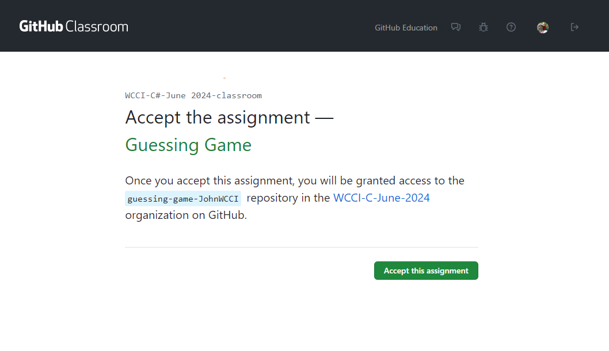

# Objective
1. Explain to the students, that the only way you can grade "Assignments" is in the Classroom.
2. Walk the students through "Accepting Assignment" in the Classroom Web Site.
3. Walk the students through Cloning a Repository.
4. Have them read over the "readme.md" file.
5. Explain that the objective is to correct the problem (without breaking the application).
   
# Java Greeting Application

This is a simple Java application that prints a greeting message and a status message to the console.

## Getting Started

These instructions will help you set up and run the application on your local machine.


### Installing
- click on the link above
- accept assignment
- in the Web Page, click "Accept this Assignment"
  	
- Now give GitHub a few minutes to build the new repository for you.
- After refreshing the page you should have a link to download your new repository
- Copy the link into your clipboard
- in VS Code, select "Clone Repository"
- Paste the link into the space provided
- This should start the process of Cloning the repository

### Running the Application
1. Navigate to the "App.java" class
2. click on "Run"

   You should see the following output:

    ```sh
    Hello from John Moseley

    Are we having fun?
    ```
## Problem
The client does not want "John Moseley" to be displayed. 
The client want his name to be Displayed "Bob Smith".

### Code Explanation

The `App` class contains a `main` method which is the entry point of the application. It prints a greeting message and a status message to the console.

Here's a brief overview of the code:

```java
/**
 * The {@code App} class demonstrates a simple Java application 
 * that prints a greeting message and a status message to the console.
 */
public class App {

    /**
     * The name to be used in the greeting message.
     */
    private static String name = "John Moseley";  // Stores the name to be displayed in the greeting

    /**
     * The status message to be printed.
     */
    private static String status = "Are we having fun?";  // Stores the status message to be printed

    /**
     * The main method that serves as the entry point for the Java application.
     *
     * @param args the command line arguments
     * @throws Exception if an exception occurs during the execution of the program
     */
    public static void main(String[] args) throws Exception {
        // Print the greeting message
        System.out.println("Hello from " + name);
        
        // Print a blank line for spacing
        System.out.println();
        
        // Print the status message
        System.out.println(status);
    }
}
